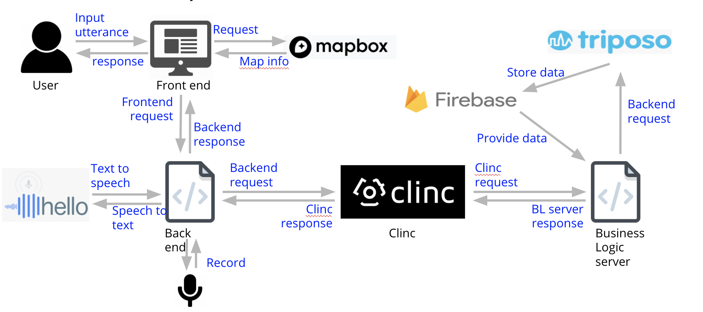

# Conversational AI - Travel Agent

A conversational Artificial Intelligence web application that can assist users to create travel itinerary by interpreting user intent. Supported by Clinc, Inc.

*A screen shot of chatting with our AI, audio is transcripted to words.*

## Overview
Our conversational AI is consisted of many components. A detailed description and functionality of each component is shown below. The following image shows the interaction between them.

- Clinc AI Platform
   - Open-source platform that designed to incorporate a conversational AI in service, based on a finite state machine

- Frontend User Interface
   - User speaks to AI through the user interface, and the final response from the AI is also displayed on user interface.
   - Support user interaction through both voice and word.

- Backend Server
   - Support data/response transfer among user interface, Google ASR, and Clinc AI platform.

- Business Logic Server
   - Request external data source to get the recommendation information 
   - Support generation of travel itinerary

- APIs
   - Google Firebase
      - Store user profile and city information from Triposo 
      - Generate route and traffic guides based on real-time information

   - Google ASR
      - Enable text-to-speech and speech-to-text conversion.
      - Support state-of-the-art speech recognition technology.

   - Triposo
      - Use Triposo API as the external data source.
      - Provide tourist destination including its coordinates to visualize the route.

   - Mapbox
      - Display itinerary on real map 
      - Generate route and traffic guides based on real-time information

*Overview of the interaction among different components.*
